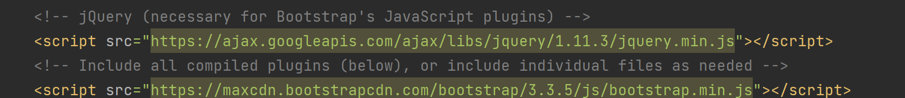
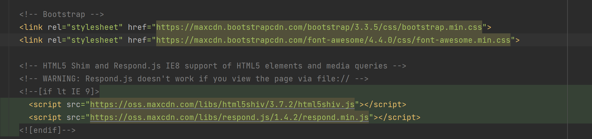

#Aufgaben im OneNote

##Auftrag 3

Die funktion erzeugt einen 60 Zeichen langen hash also:
CHAR(60)

##Auftrag 4
Nicht viel, mann kann auf den hash alorythmus zurückschliesen mehr aber nicht

##Autrag 5

Mit der Funktion:
`password_verify($password, [DB-Hash]);`

##Auftrag 6

Bootstrap:

Bootstrap ist im grunde einfach eine grosse ansammlung von CSS Klassen, welche man in seinem Projekt verwenden kann.